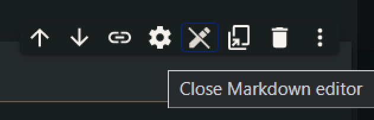
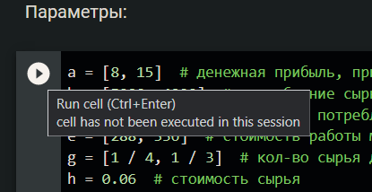
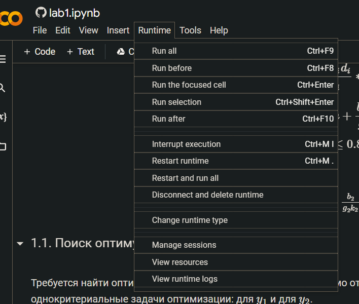
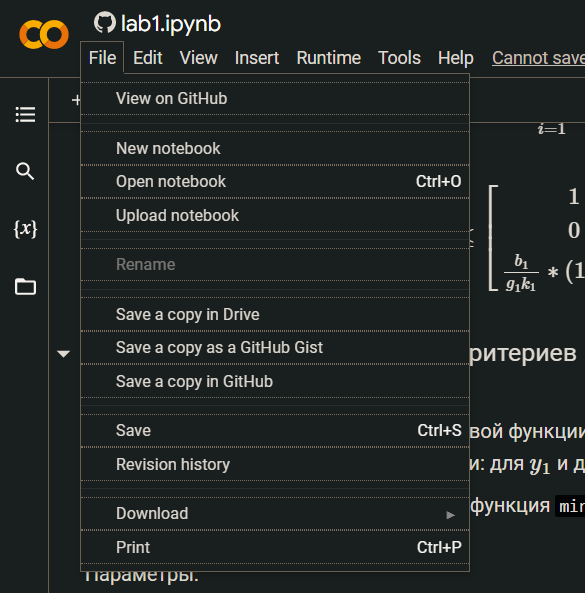
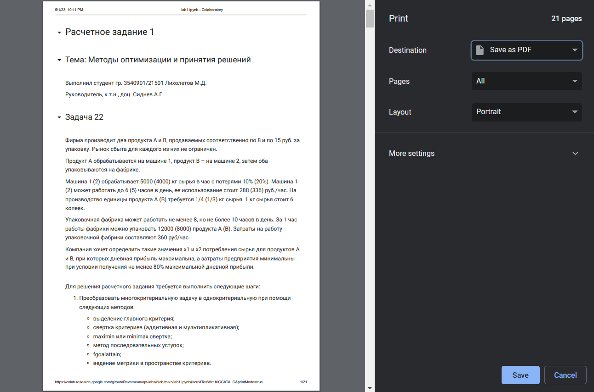

# Методы оптимизации и принятия решений

Проект для выполнения расчетных заданий при помощи инструмента Jupyter Notebook. 

## Расчетные задания

### 1. Многокритериальная оптимизация

[](https://colab.research.google.com/github/Reversean/opt-labs/blob/main/lab1.ipynb)

### 2. Марковские модели принятия решений

[](https://colab.research.google.com/github/Reversean/opt-labs/blob/main/lab2.ipynb)

### 3. Марковские модели принятия решений

TODO

### 4. Анализ GERT-сети

[](https://colab.research.google.com/github/Reversean/opt-labs/blob/main/lab4.ipynb)

## Инструкция по использованию

Сервис Google colab позволяет просматривать и запускать документы Jupyter Notebook, позволяющие совмещать исполняемый 
код на языке программирования Python и текстовое описание. В документах формата Jupyter Notebook (.ipynb) все содержимое 
разделяется на 2 типа секций:

- С текстом
- С кодом

Секции с текстом поддерживают формат разметки [Markdown](https://www.markdownguide.org/). Для редактирования текстовой 
секции нужно дважды кликнуть по ней. Для выхода из режима редактирования нужно нажать по кнопке "Close Markdown editor" 
в правой верхней части редактора.



Markdown поддерживает вставки в формате $\LaTeX$. Пример:

```markdown
$$
P(\sum_{j=1}^n a_{ij} x_j - b_i \leq 0) \geq \alpha_i
$$
```

Результат:

$$
P(\sum_{j=1}^n a_{ij} x_j - b_i \leq 0) \geq \alpha_i
$$

Секции с кодом могут быть запущены разными способами:

1. Кнопка "Run cell" слева от секции:



Данная кнопка запускает только указанную секцию.

Запускать секции можно с кодом в любом порядке, однако стоит помнить, что если какие-то поля, методы или классы были
декларированы в других секциях с кодом

2. Меню "Runtime" в верхней панели:



Данное меню позволяет запускать секции разным образом:

- Запустить все секции кода последовательно ("Run all")
- Запустить все секции до сфокусированной в данный момент секции ("Run before")
- Запустить сфокусированную в данный момент секцию ("Run the focused cell")
- Запустить выделенный в секции код ("Run selection")
- Запустить все секции после сфокусированной в данный момент секции ("Run after")

Если у секции есть вывод в том или ином виде (текст, изображения, таблицы), они отобразятся ниже сегмента с кодом после 
его выполнения.

Копию документа можно сохранить на Google Диск или в личном репозитории на Github. Сделать этом можно в меню "File" на 
верхней панели:



В этом же меню можно экспортировать документ в формат PDF ("Print")

